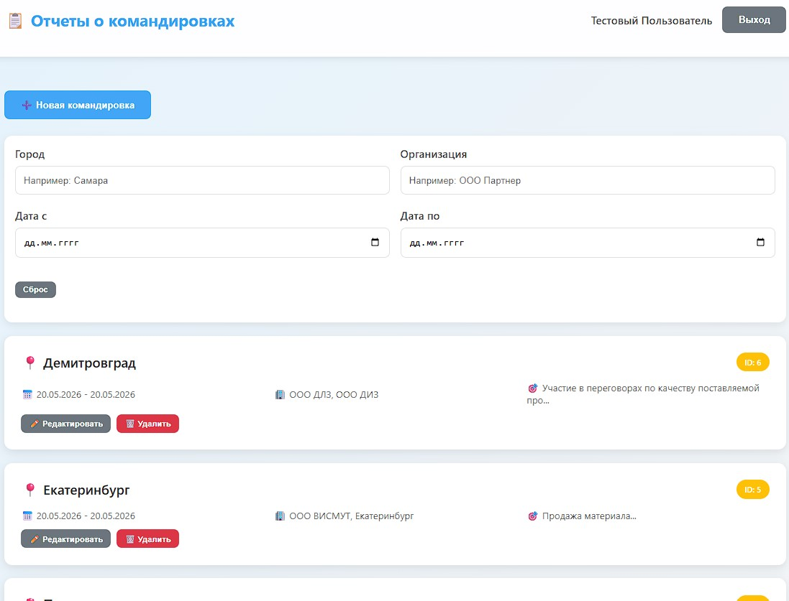
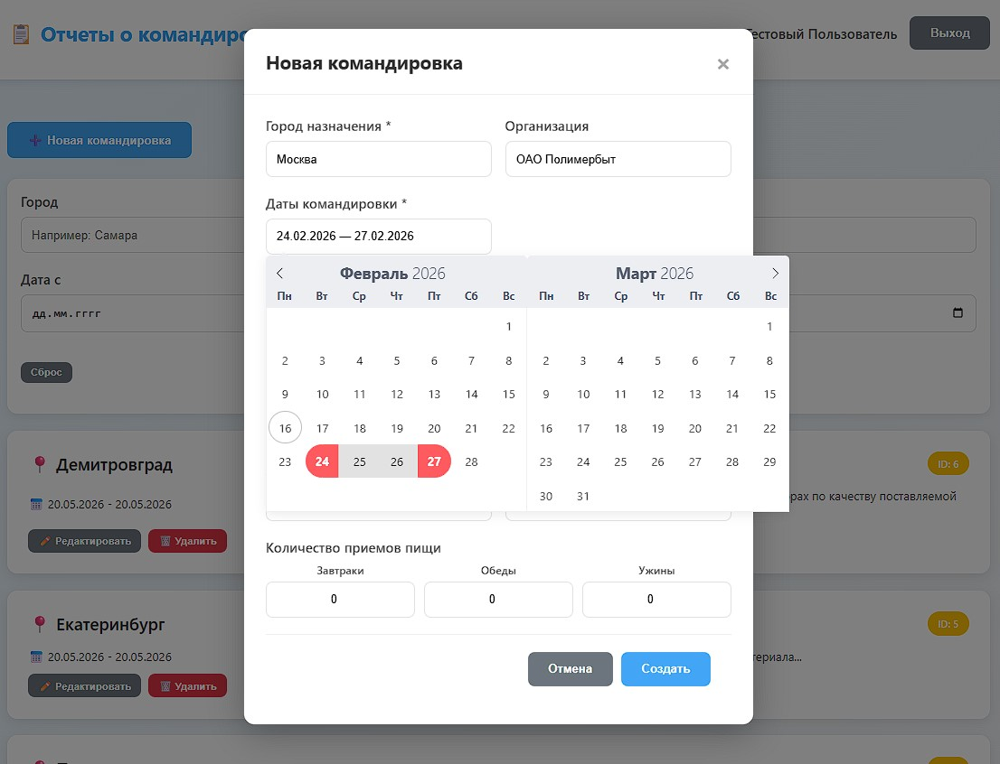
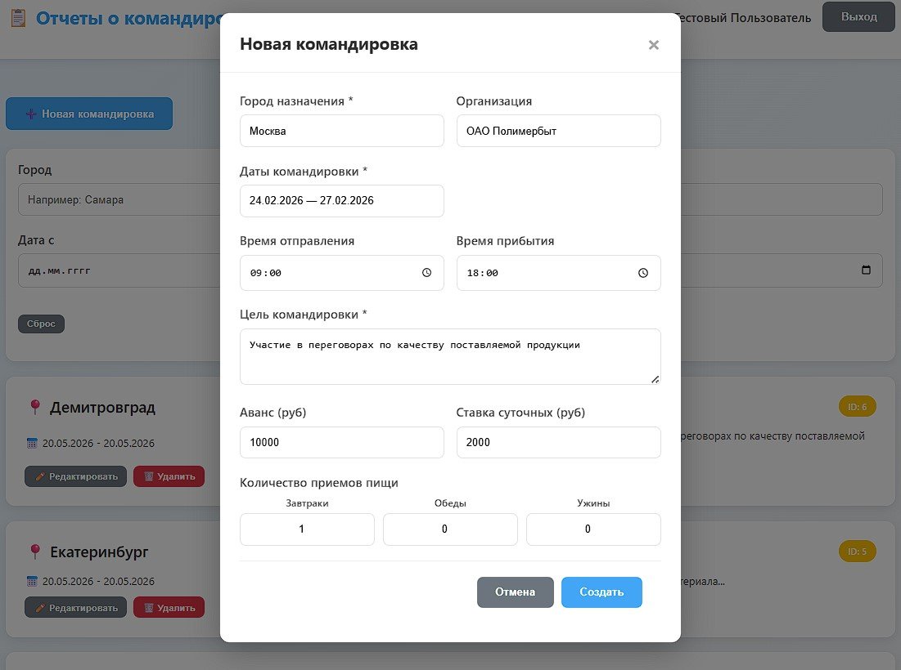
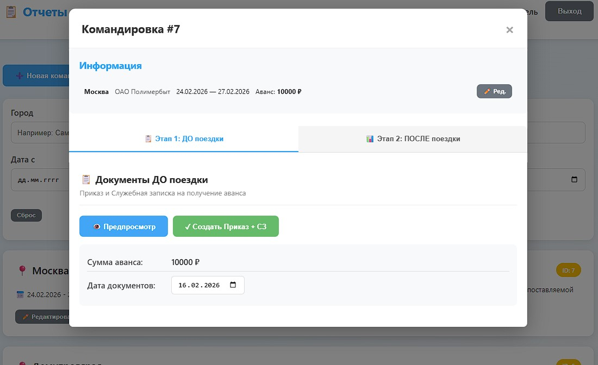
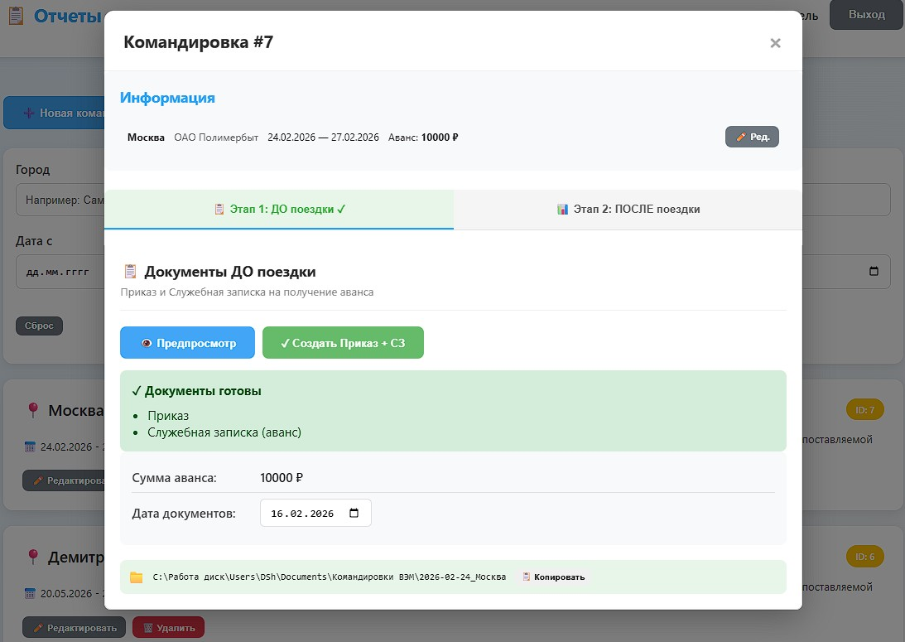
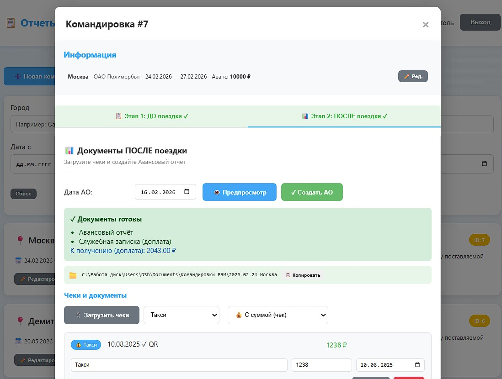
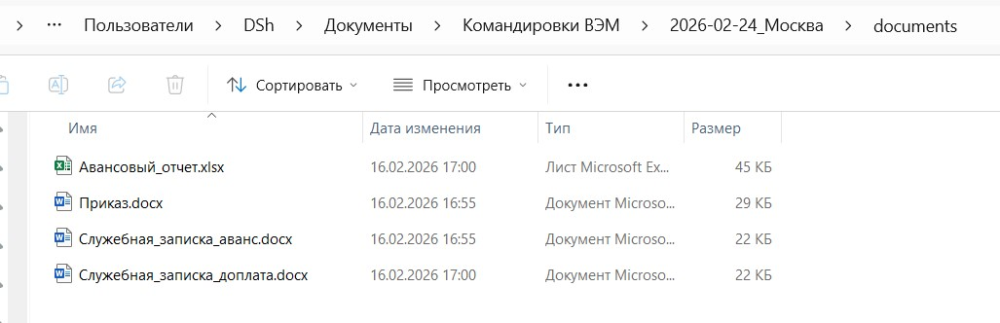
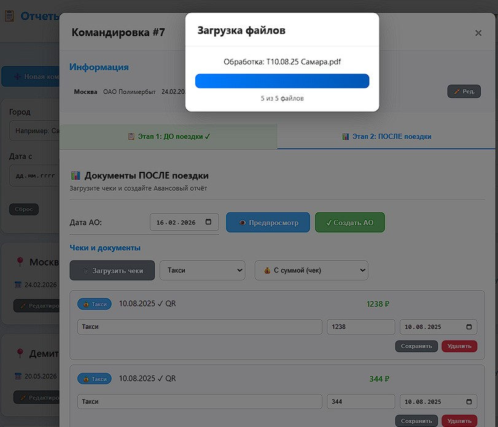
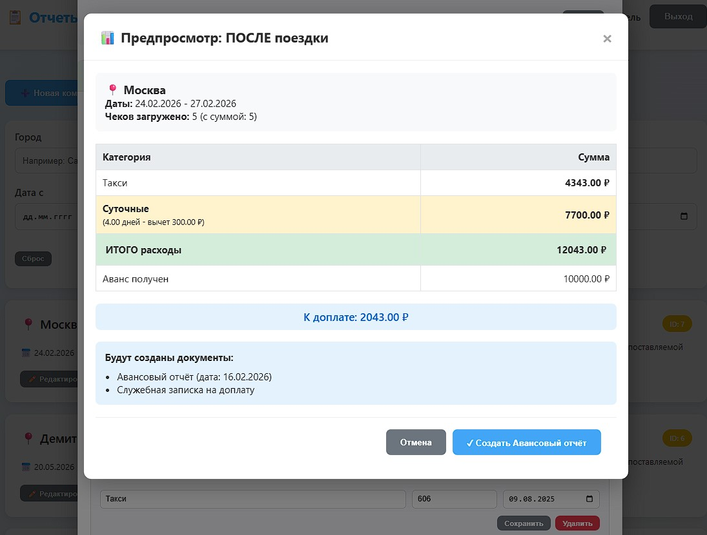

# TripHPM - Business Trip Report Management System

<div align="center">


**Автоматизированная система управления командировочной отчётностью**

[Возможности](#-возможности) •
[Демо](#-демо) •
[Установка](#-установка) •
[Использование](#-использование) •
[API](#-api) •
[Технологии](#-технологии)

</div>

---

## 📋 О проекте

**TripHPM** — это полнофункциональная веб-система для автоматизации процесса оформления командировочных документов. Система позволяет создавать командировки, загружать чеки с автоматическим распознаванием QR-кодов и OCR, генерировать все необходимые документы (Приказ, Служебные записки, Авансовый отчёт) и управлять отчётностью.

### Проблема
Оформление командировочных документов — трудоёмкий процесс, требующий заполнения множества форм, расчёта суточных, сбора чеков и подготовки отчётов. Ручное оформление занимает часы и подвержено ошибкам.

### Решение
TripHPM автоматизирует весь процесс: от создания командировки до генерации готовых документов. Система сама распознаёт данные с чеков, рассчитывает суточные с учётом времени выезда/приезда и формирует документы по корпоративным шаблонам.

---

## 🎯 Возможности

### Управление командировками
- Создание командировок с указанием дат, города назначения и цели
- Двухэтапный процесс: документы ДО поездки и ПОСЛЕ поездки
- Статусы командировок с визуальным отслеживанием прогресса
- Фильтрация и поиск по командировкам

### Работа с чеками
- Загрузка чеков в форматах PDF, JPG, PNG
- **Автоматическое распознавание QR-кодов** фискальных чеков
- **OCR-распознавание** текста для извлечения суммы и даты
- Категоризация расходов (транспорт, проживание, топливо и др.)
- Ручное редактирование распознанных данных

### Генерация документов
- **Приказ о направлении в командировку** (.docx)
- **Служебная записка на аванс** (.docx)
- **Авансовый отчёт** (.xlsx) — с сохранением форматирования Excel
- **Служебная записка на доплату** (при перерасходе)
- Автоматический расчёт суточных с учётом времени

### Расчёты
- Расчёт суточных по формуле с учётом времени выезда/приезда
- Учёт налогообложения суточных свыше лимита
- Автоматический расчёт баланса (к возврату / к доплате)
- Группировка расходов по категориям

---

## 📸 Демо

### Главный экран — список командировок


### Работа с командировкой
| Детали командировки | Загрузка чеков |
|:---:|:---:|
|  |  |

| Распознанные чеки | Редактирование данных |
|:---:|:---:|
|  |  |

### Генерация документов
| Документы ДО поездки | Документы ПОСЛЕ поездки |
|:---:|:---:|
|  |  |

### Скачивание документов
| Предпросмотр | Готовые документы |
|:---:|:---:|
|  |  |

---

## 🛠 Технологии

### Backend
| Технология | Назначение |
|------------|------------|
| **Python 3.10+** | Основной язык |
| **FastAPI** | REST API фреймворк |
| **SQLAlchemy** | ORM для работы с БД |
| **SQLite** | База данных |
| **Pydantic** | Валидация данных |
| **python-docx** | Генерация Word документов |
| **win32com** | Работа с Excel без потери форматирования |
| **EasyOCR** | Распознавание текста на изображениях |
| **pyzbar** | Чтение QR-кодов |
| **PyMuPDF** | Работа с PDF файлами |

### Frontend
| Технология | Назначение |
|------------|------------|
| **HTML5/CSS3** | Разметка и стили |
| **JavaScript (ES6+)** | Логика интерфейса |
| **Flatpickr** | Выбор дат |
| **Fetch API** | HTTP запросы |

### Инфраструктура
- JWT авторизация
- RESTful API архитектура
- Модульная структура проекта

---

## 📦 Установка

### Требования
- Python 3.10 или выше
- Microsoft Excel (для генерации xlsx через COM)
- Windows (для win32com)

### Шаги установки

```bash
# 1. Клонируйте репозиторий
git clone https://github.com/Dmitriy-Schneider/TripHPM.git
cd TripHPM

# 2. Создайте виртуальное окружение
python -m venv venv

# 3. Активируйте окружение
# Windows:
venv\Scripts\activate
# Linux/Mac:
source venv/bin/activate

# 4. Установите зависимости
pip install -r backend/requirements.txt

# 5. Создайте файл конфигурации
cp backend/.env.example backend/.env
# Отредактируйте .env под ваши настройки

# 6. Запустите сервер
# Windows:
start_server.bat
# Или напрямую:
cd backend && python -m app.main --port 8080
```

### Конфигурация (.env)

```env
# Безопасность
SECRET_KEY=your-secret-key-here

# Сервер
HOST=0.0.0.0
PORT=8080

# Организация
DEFAULT_ORG_NAME=Ваша организация
DEFAULT_PER_DIEM_RATE=2000.0
DEFAULT_DEPARTURE_CITY=Москва

# Директория для документов (опционально)
CUSTOM_OUTPUT_DIR=C:\Documents\Командировки
```

---

## 🚀 Использование

### Быстрый старт

1. **Запустите сервер** — `start_server.bat`
2. **Откройте браузер** — http://localhost:8080
3. **Войдите в систему** — логин: `test`, пароль: `test`
4. **Создайте командировку** — укажите даты и город
5. **Загрузите чеки** — система автоматически распознает данные
6. **Сгенерируйте документы** — нажмите "Создать" на каждом этапе

### Рабочий процесс

```
┌─────────────────┐     ┌─────────────────┐     ┌─────────────────┐
│  ДО ПОЕЗДКИ     │     │   ПОЕЗДКА       │     │  ПОСЛЕ ПОЕЗДКИ  │
│                 │     │                 │     │                 │
│  • Приказ       │ ──► │  • Сбор чеков   │ ──► │  • Авансовый    │
│  • СЗ на аванс  │     │  • Расходы      │     │    отчёт        │
│                 │     │                 │     │  • СЗ доплата   │
└─────────────────┘     └─────────────────┘     └─────────────────┘
```

---

## 📁 Структура проекта

```
TripHPM/
├── backend/
│   ├── app/
│   │   ├── api/              # API endpoints
│   │   │   ├── auth.py       # Авторизация
│   │   │   ├── trips.py      # Командировки
│   │   │   ├── receipts.py   # Чеки
│   │   │   └── users.py      # Пользователи
│   │   ├── models/           # SQLAlchemy модели
│   │   ├── services/
│   │   │   ├── document_generator_simple.py  # Генерация документов
│   │   │   └── qr_reader.py  # QR и OCR распознавание
│   │   ├── utils/
│   │   │   └── auth.py       # JWT утилиты
│   │   ├── config.py         # Конфигурация
│   │   ├── database.py       # Подключение к БД
│   │   └── main.py           # Точка входа
│   ├── templates/            # Шаблоны документов
│   │   ├── ao_template.xlsx
│   │   ├── sz_template.docx
│   │   └── prikaz_template.docx
│   ├── requirements.txt
│   └── .env.example
├── frontend/
│   ├── index.html
│   ├── css/style.css
│   └── js/app.js
├── start_server.bat
├── start_server_prod.bat
└── README.md
```

---

## 🔌 API

### Основные endpoints

| Метод | Endpoint | Описание |
|-------|----------|----------|
| `POST` | `/auth/login` | Авторизация |
| `GET` | `/trips/` | Список командировок |
| `POST` | `/trips/` | Создать командировку |
| `GET` | `/trips/{id}` | Детали командировки |
| `POST` | `/trips/{id}/generate-pre-trip` | Генерация документов ДО |
| `POST` | `/trips/{id}/generate-post-trip` | Генерация документов ПОСЛЕ |
| `POST` | `/receipts/trip/{id}/upload` | Загрузка чека |
| `PUT` | `/receipts/{id}` | Редактирование чека |
| `DELETE` | `/receipts/{id}` | Удаление чека |

### Пример запроса

```bash
# Авторизация
curl -X POST http://localhost:8080/auth/login \
  -H "Content-Type: application/x-www-form-urlencoded" \
  -d "username=test&password=test"

# Получение списка командировок
curl http://localhost:8080/trips/ \
  -H "Authorization: Bearer YOUR_TOKEN"
```

---

## 🔒 Безопасность

- JWT токены для авторизации
- Хеширование паролей (bcrypt)
- Валидация всех входных данных
- Проверка прав доступа к ресурсам
- CORS настройки

---

## 🤝 Contributing

Contributions приветствуются! Пожалуйста:

1. Сделайте Fork репозитория
2. Создайте ветку для фичи (`git checkout -b feature/amazing-feature`)
3. Сделайте коммит (`git commit -m 'Add amazing feature'`)
4. Запушьте в ветку (`git push origin feature/amazing-feature`)
5. Откройте Pull Request

---

## 📝 Лицензия

Распространяется под лицензией MIT. См. файл `LICENSE` для подробностей.

---

## 👤 Автор

**Dmitriy Schneider**

- GitHub: [@Dmitriy-Schneider](https://github.com/Dmitriy-Schneider)

---

<div align="center">

⭐ Если проект был полезен, поставьте звезду!

</div>
